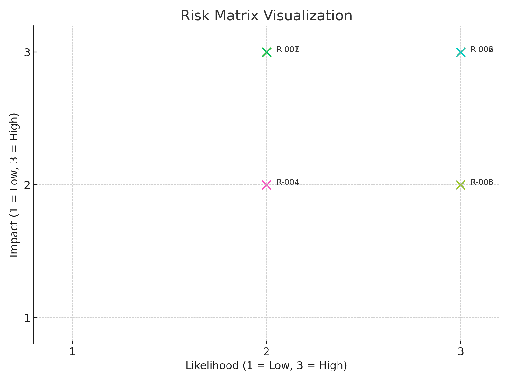
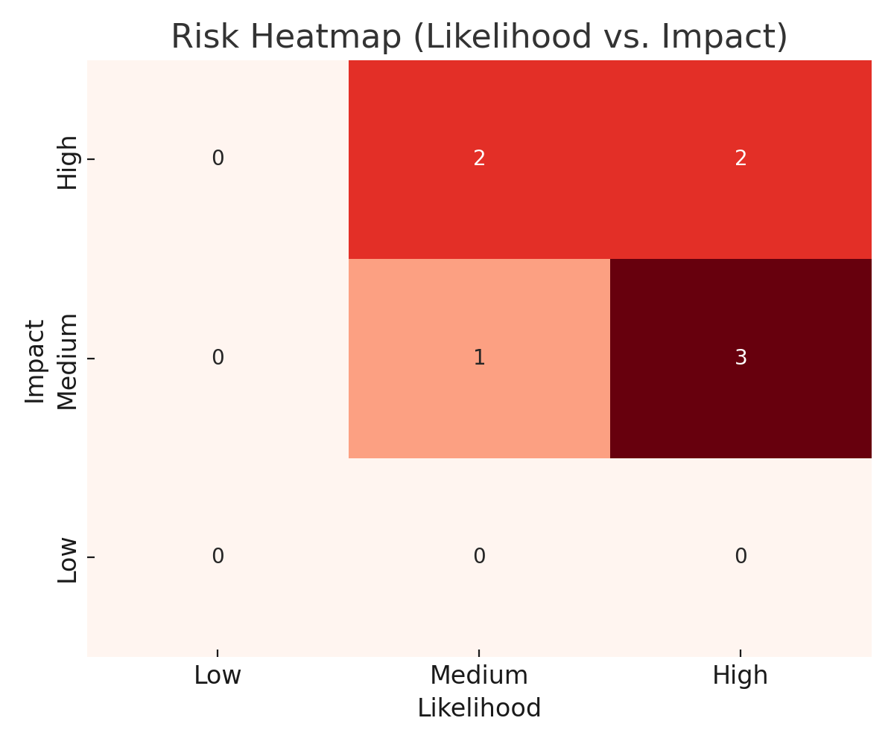

# 🧾 Risk Register Lab – NIST CSF (Identify Function)

## 📌 Purpose

This lab demonstrates how to create a basic risk register aligned with the **Identify** function of the NIST Cybersecurity Framework (CSF). The goal is to simulate a foundational risk assessment process for a small organization or environment.

---

## 📋 Risk Register Overview

The risk register documents potential cybersecurity risks, assigns values for **likelihood** and **impact**, and proposes **mitigation strategies**. This structured format helps prioritize threats and improve decision-making.

### 🔒 Sample Risk Entries

| Risk ID | Description                    | Likelihood | Impact | Risk Score (L×I) | Mitigation Strategy                              |
|---------|--------------------------------|------------|--------|------------------|--------------------------------------------------|
| R-001   | Unpatched software             | Medium     | High   | 9                | Implement monthly patching policy               |
| R-002   | Weak access controls           | High       | High   | 12               | Enforce multi-factor authentication (MFA)       |
| R-003   | Phishing email threats         | High       | Medium | 9                | Security awareness training for employees       |
| R-004   | Lack of employee security training | Medium | Medium | 6                | Conduct quarterly security training              |
| R-005   | Outdated antivirus definitions | High       | Medium | 9                | Enable automatic antivirus updates               |
| R-006   | Unauthorized USB device usage  | High       | High   | 12               | Restrict USB ports and use endpoint controls     |
| R-007   | Insecure cloud storage permissions | Medium | High   | 9                | Apply least privilege and regular audits         |
| R-008   | Poor password hygiene          | High       | Medium | 9                | Enforce password manager and strong password policy |

> 💡 Risk scores are based on a 1–3 scale for both Likelihood and Impact (1 = Low, 3 = High).

---

### 📊 Risk Matrix Visualization

This scatter plot maps each risk by its Likelihood and Impact:

### 🔥 Risk Heatmap (Likelihood vs. Impact)

This heatmap shows how risks are distributed based on their likelihood and impact scores:

## 🛠️ Tools Used

- **Google Sheets / Excel** – To structure and score the risk register
- **GitHub** – For documentation and version control
- **Python (Matplotlib, Seaborn)** – For creating risk matrix and heatmap visualizations
- **NIST CSF (Identify)** – Framework guiding risk identification

---

## ✅ Lessons Learned

- Risk scoring helps prioritize security efforts
- Maintaining a risk register improves visibility and accountability
- Governance frameworks like NIST CSF support consistent, scalable risk practices

---

## 📂 Files Included

- `README.md` – Full project summary, risk register table, and visuals
- `risk_register_updated.xlsx` – Excel file with 8 scored and mitigated risks
- `risk_matrix_visual.png` – Scatter plot mapping each risk by Likelihood and Impact
- `risk_matrix_heatmap.png` – Color-coded heatmap showing risk concentration

---

