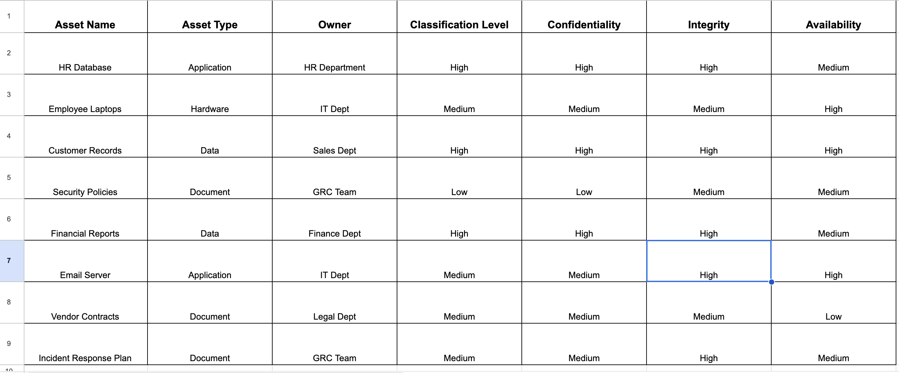

# 🛡️ Asset Classification Lab (NIST CSF – Identify Function)

## 📌 Overview
This lab focuses on classifying organizational assets based on their criticality, sensitivity, and business impact. Asset classification is a foundational step in managing cybersecurity risks effectively, aligning with the NIST CSF subcategory **ID.AM-5: Resources are prioritized based on their classification, criticality, and business value.**

## 🎯 Objectives
- Identify a range of typical organizational assets
- Apply the Confidentiality, Integrity, and Availability (CIA) triad to assess asset value
- Assign classification levels (High, Medium, Low)
- Support risk-informed decision-making and resource prioritization

## 🧰 Tools Used
- Google Sheets / Microsoft Excel
- Manual asset classification framework (based on CIA triad)

## 🪜 Steps Performed
1. **Asset Identification:** Listed common hardware, software, data, and systems used in an organization.
2. **CIA Evaluation:** Assessed each asset’s sensitivity across Confidentiality, Integrity, and Availability dimensions.
3. **Classification Assignment:** Mapped each asset to a classification level (e.g., High, Medium, Low).
4. **Business Impact Mapping:** Documented notes on how each asset contributes to organizational operations.

## 📸 
_A preview of the classification matrix:_

## 🧠 Key Takeaways
- Classification enables effective prioritization of cybersecurity controls.
- Assets with higher impact require stricter protections and monitoring.
- This exercise supports stronger alignment with governance and compliance goals.

## 📂 Files Included
- `asset-classification.xlsx`: Full asset classification matrix
- `classification-screenshot.png`: Visual preview of the matrix
