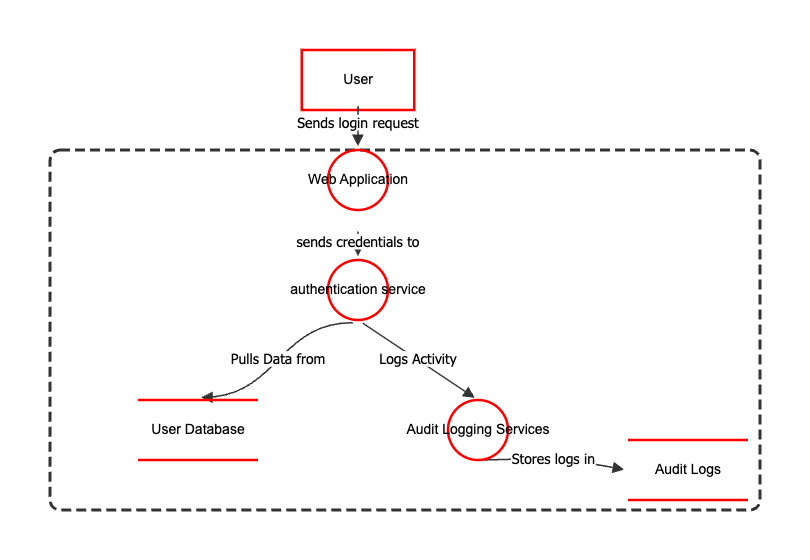

# 📌 Threat Modeling Using OWASP Threat Dragon  
**NIST CSF Function:** Identify  
**Category:** Risk Assessment (ID.RA)

---

## 📖 Overview  
This lab demonstrates how to conduct a basic threat modeling exercise for a company web application using OWASP Threat Dragon. It follows the STRIDE methodology to identify potential security threats and improve the security posture early in the design phase.

---

## 🛠️ Tools Used  
- **OWASP Threat Dragon** (Desktop app for macOS ARM64)  
- **STRIDE Model** for threat identification  
- **GitHub** for documentation and version control

---

## 🎯 Objective  
To simulate a real-world task of a GRC analyst: identifying, visualizing, and assessing threats to a web application and documenting it using STRIDE categories.

---

## 🧩 System Overview  
The application modeled is a basic web login system that includes:  
- User login request  
- Web application  
- Authentication service  
- User database  
- Audit logging service  
- Audit logs  
- Trust boundary between user and internal components

---

## 📌 STRIDE Threat Categories Addressed  
| Threat | Example from Model | Mitigation |
|--------|---------------------|------------|
| **Spoofing** | Impersonation of user credentials | MFA, secure auth |
| **Tampering** | Altering login requests | Input validation, HTTPS |
| **Repudiation** | Denying login attempts | Audit logs |
| **Information Disclosure** | Leaked credentials in transit | TLS encryption |
| **Denial of Service** | Overload on auth service | Rate limiting |
| **Elevation of Privilege** | Bypassing auth checks | Role-based access |

---

## 🖼️ Threat Model Diagram  

---

## 📝 Key Takeaways  
- Visual threat models clarify trust zones and potential attack vectors.  
- STRIDE helps organize and prioritize risks.  
- GRC analysts can use this for assessing application design security.
